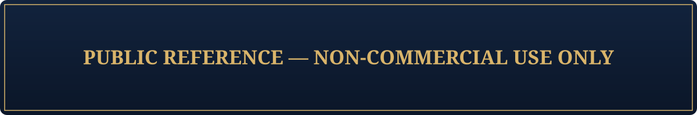

<p align="center">
  
</p>

# 🏛️ Realm of Achievements — Visual Identity (Public Reference)

> Repositório público de referência do sistema de identidade visual do universo **Realm of Achievements**.  
> Inclui paleta de cores, fontes, ícones e temas neutros destinados a **integração, documentação e testes visuais**.

---

## 🎨 Estrutura
```
visual-identity-public/
├── Assets/
│ ├── Fonts/ # Fontes públicas de referência
│ ├── Icons/ # Ícones base (SVG/ICO)
│ └── colors.json # Paleta de cores neutra
│
├── avalonia/ # Tema de referência para Avalonia UI
│ ├── theme-avalonia.axaml
│ └── theme-avalonia.resources.axaml
│
├── playwright/ # Tema CSS para automação (CLI)
│ └── theme-playwright.css
│
├── godot/ # Tema Godot para cenas e UI
│ └── theme-godot.tres
│
└── README.md
```
---

## 💡 Objetivo

Este repositório tem como propósito:
- Servir como **base de integração** entre diferentes tecnologias (Avalonia, Playwright, Godot);
- Fornecer **referência visual pública** para colaboradores e publishers;
- Garantir consistência no design em todos os componentes do ecossistema Realm of Achievements.

---

## 🧩 Integrações de Exemplo

### 1️⃣ Avalonia (Launcher)
```xml
<ItemGroup>
  <AvaloniaResource Include="../visual-identity-public/avalonia/**/*.axaml" />
</ItemGroup>
```
E no App.axaml:
```xml
<Application.Styles>
  <StyleInclude Source="../visual-identity-public/avalonia/theme-avalonia.axaml"/>
</Application.Styles>
```
### 2️⃣ Playwright (CLI)
```js
// Adiciona tema no setup da página
await page.addStyleTag({ path: "./visual-identity/playwright/theme-playwright.css" });

// Para aplicar cores via JSON:
import colors from "./visual-identity/colors.json";
await page.addStyleTag({ content: `:root { --accent: ${colors.primary}; }` });
```
### 3️⃣ Godot (Game)
```gdscript
# Aplica tema globalmente na inicialização
var theme = load("res://visual-identity/godot/theme-godot.tres")
get_tree().root.set_theme(theme)
```
## 🧱 Design System

| Categoria  | Arquivo                              | Descrição                                                |
| ---------- | ------------------------------------ | -------------------------------------------------------- |
| 🎨 Cores   | `colors.json`                        | Paleta de tons base (primário, secundário, texto, fundo) |
| 🖋️ Fontes  | `/Assets/Fonts/`                     | Família Open Sans — variações Regular, Bold, Italic      |
| 🧩 Ícones  | `/Assets/Icons/`                     | SVGs de interface e logotipos neutros                    |
| 🧱 Temas   | `avalonia/`, `playwright/`, `godot/` | Estilos prontos para cada tecnologia                     |

## ⚠️ Licença de Uso
> Atenção: Este repositório é público apenas para fins de documentação, integração e demonstração.
> Todo o conteúdo permanece sob direitos autorais de Rubens do Amaral Neto / Realm of Achievements.
```vbnet
NOTE:
This repository provides public access to the Realm of Achievements Visual Identity
for documentation and integration purposes only.

Commercial use, redistribution, or republication of the included assets,
fonts, or themes without explicit written permission is strictly prohibited.
```
## 👤 Autor
Rubens do Amaral Neto
© 2025 Realm of Achievements — All rights reserved.
[GitHub @rubens-amaral](https://github.com/rubens-amaral)

## 📦 Repositórios Relacionados

| Projeto                                                                       | Descrição                                    |
| ----------------------------------------------------------------------------- | -------------------------------------------- |
| [`steam-game-launcher`](https://github.com/rubens-amaral/steam-game-launcher) | Launcher desktop baseado em Avalonia         |
| [`steam-sync-cli`](https://github.com/rubens-amaral/steam-sync-cli)           | CLI multiplataforma com automação Playwright |
| [`steam-game`](https://github.com/rubens-amaral/steam-game)                   | Jogo/simulador principal (Godot)             |

✨ “A coerência visual é o primeiro elo entre o jogador e o universo que ele habita.”
— Realm of Achievements Design Manifesto
